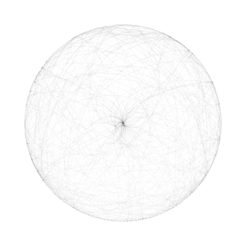

# sketches
Toy programs to investigate various topics in math and computer science

## Subprojects
### [Pendulum](Pendulum)
A simulation of a double pendulum.

Sample output:

### [Complex](Complex)
A complex-function grapher.

Sample output:

### [Sequences](Sequences)
Sequence guesser written as a bonus problem for CS 135. The program acecepts a list of numbers as input and produces a function which can produce any term in the sequence.

Sample output: The function guessed for the sequence `'(1 -4 7 -10))` produces the extended sequence `'(1 -4 7 -10 13 -16 19 -22 25 -28 31)`

_More sample output can be found at the top of the code, in the `tests` variable._